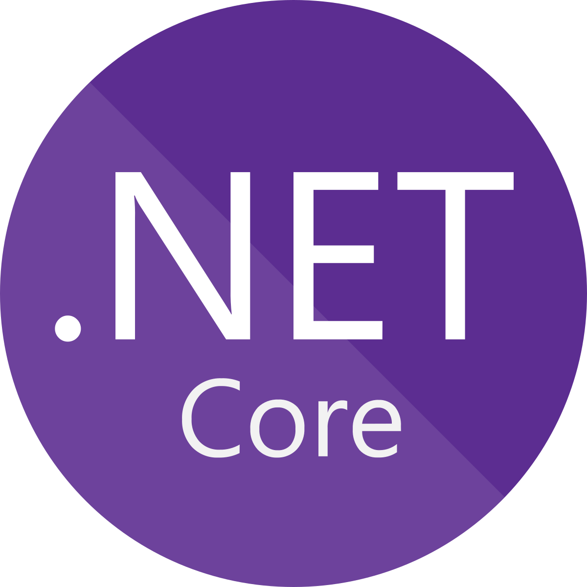

 

- 👋 Hi, I’m Emad Bushofa, a Cloud Solution Developer and Principal Software Engineer at ECOM LTD.
- ❤️ I’m interested in learning new cloud development solutions for enterprise companies development.
- 🔥 Continuously learning on how to build highly scalable distributed systems on Microsoft Azure.
- ☝️ My goal this year is to collaborate more tp open source projects, giving a constant time each day.

### Top Skills:

### Follow me in the below platforms:

